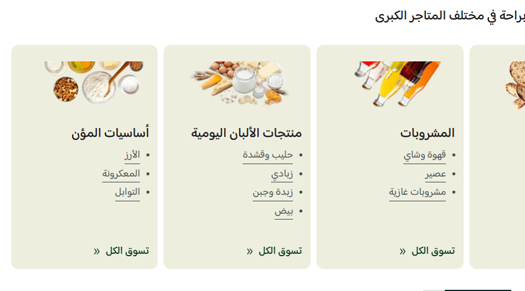

# عرض التصنيفات (Category showcase)

دليل العميل لسكشن **عرض التصنيفات**: بطاقات كبيرة تجمع صورة التصنيف وروابطه الفرعية في مكان واحد.

| | |
|---|---|
| **الاسم في المحرر** | عرض التصنيفات |
| **الاسم بالإنجليزية** | Category showcase |
| **الملفات** | `sections/category-showcase.jinja` · `sections/category-showcase.schema.json` |
| **الاستخدام** | إبراز مجموعات رئيسية، وتوجيه الزائر مباشرة إلى الروابط الفرعية أو «تسوّق الكل» |

---

## شكل السكشن على المتجر

كل بطاقة تحتوي على صورة، عنوان، روابط فرعية، ورابط اختياري لتصفّح المجموعة كاملة.

---

## 1) كيفية الإضافة

1. افتح **محرر الثيم** في زد.
2. اختر الصفحة المطلوبة، وغالبًا الصفحة الرئيسية.
3. اضغط **إضافة قسم** → **عرض التصنيفات**.
4. اختر طريقة العرض: **سلايدر** أو **شبكة**.
5. أضف البطاقات وروابط كل بطاقة، ثم اضبط التخطيط.

> للحصول على نتيجة واضحة، استخدم صورًا متناسقة وأضف من 3 إلى 5 روابط فرعية فقط داخل كل بطاقة.

---

## 2) ترتيب الإعدادات في المحرر

### أ) طريقة العرض

| القيمة | الاستخدام المناسب |
|---|---|
| سلايدر | عدد بطاقات كبير أو مساحة أفقية محدودة |
| شبكة | عرض جميع البطاقات مباشرة بدون سحب |

### ب) العنوان

يمكن إظهار أو إخفاء عنوان القسم، ثم ضبط النص والمحاذاة واللون.

### ج) التخطيط

| الإعداد | ماذا يفعل؟ |
|---|---|
| اتجاه القسم | تلقائي حسب لغة المتجر، RTL، أو LTR |
| المسافة بين البطاقات | قيمة مستقلة للويب والموبايل |
| المسافة تحت العنوان | تفصل العنوان عن البطاقات |
| استدارة البطاقة | تتحكم في تدوير الزوايا |
| خلفية البطاقة | اللون الافتراضي للبطاقات |
| نسبة عرض الصورة | تحدد شكل مساحة الصورة داخل البطاقة |
| المسافات العلوية والسفلية | قيم مستقلة للويب والموبايل |
| عرض الشاشة بالكامل | يمد السكشن إلى كامل عرض الشاشة |

### د) إعدادات السلايدر

تظهر فقط عند اختيار **سلايدر**:

- عدد البطاقات الظاهرة لكل مقاس شاشة.
- أسهم تنقل مستقلة للديسكتوب والموبايل.
- شريط تقدم مع لون مخصص.
- تكرار لا نهائي.
- تشغيل تلقائي وتأخير من 2 إلى 10 ثوانٍ.

### هـ) إعدادات الشبكة

تظهر فقط عند اختيار **شبكة**، وتحدد عدد الأعمدة للجوال الصغير والكبير والتابلت واللابتوب والديسكتوب.

### و) بطاقات التصنيفات (حتى 12)

| الإعداد | الشرح |
|---|---|
| الصورة وملاءمتها | صورة البطاقة بنمط Cover أو Contain |
| عنوان البطاقة ولونه | الاسم الرئيسي للمجموعة |
| خلفية البطاقة | لون خاص يتجاوز اللون الافتراضي |
| ألوان الروابط | اللون العادي، الهوفر، وخط الهوفر |
| الروابط | حتى 8 روابط فرعية، لكل رابط نص ووجهة |
| تسوّق الكل | رابط اختياري مع نص ووجهة وألوان خاصة |
| من يرى البطاقة؟ | الجميع، الزوار فقط، أو العملاء المسجلون |
| تقييد حسب الدولة | إظهار البطاقة لدول محددة فقط |

---

## 3) سيناريوهات جاهزة

### A — سوبرماركت متعدد الأقسام

- الطريقة: سلايدر.
- 4 بطاقات على اللابتوب و6 على الديسكتوب.
- 3 أو 4 روابط فرعية لكل بطاقة.
- فعّل «تسوّق الكل» وشريط التقدم.

### B — متجر صغير

- الطريقة: شبكة.
- عمودان على الجوال و4 على الديسكتوب.
- 4 إلى 6 بطاقات فقط.
- استخدم صورًا موحدة بنسبة عرض واحدة.

### C — عروض حسب الجمهور أو الدولة

- أنشئ بطاقات مخصصة للعملاء المسجلين أو الزوار.
- فعّل تقييد الدولة للعروض المحلية.
- افصل أسماء الدول بفاصلة، مثل: `السعودية, مصر`.

---

## ملاحظات مهمة

- البطاقة لا ترتبط بتصنيف تلقائيًا؛ أضف وجهة كل رابط يدويًا.
- إعدادات السلايدر والشبكة تتبدل حسب «طريقة العرض».
- إذا اختفت بطاقة، راجع إعدادات الجمهور والدولة قبل مراجعة الصورة أو الروابط.
