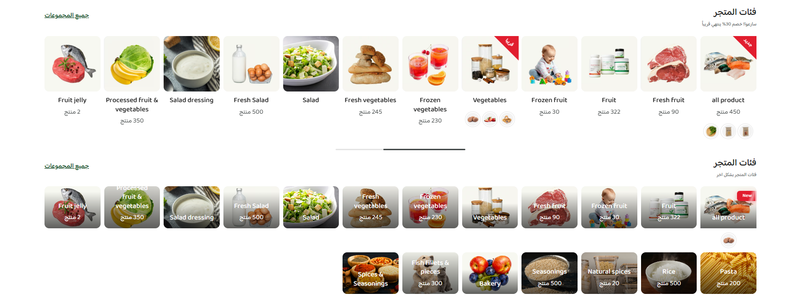
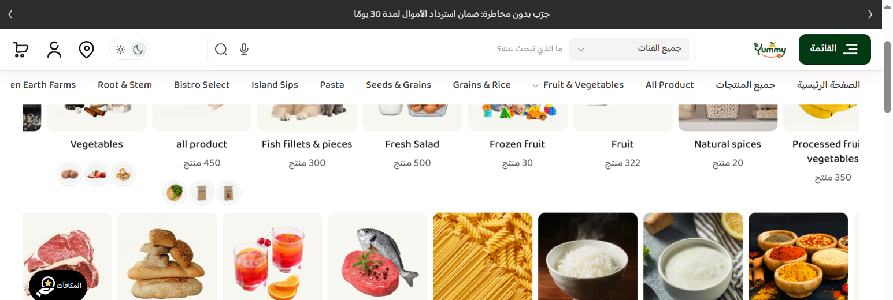
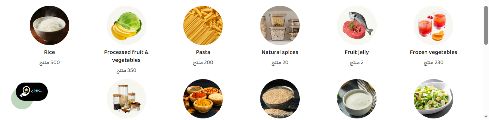

# قائمة التصنيفات (Collection list)

دليل العميل لسكشن **قائمة التصنيفات** في الثيم.

| | |
|---|---|
| **الاسم في المحرر** | قائمة التصنيفات |
| **الاسم بالإنجليزية** | Collection list |
| **الملفات** | `sections/collection-grid.jinja` · `sections/collection-grid.schema.json` |
| **الاستخدام** | عرض تصنيفات المتجر كسلايدر أو شبكة بأشكال بطاقات متعددة |

---

## شكل السكشن على المتجر

مثال لشكلين شائعين: صف واحد بعناوين تحت الصورة، وصفّان بعناوين فوق الصورة:

مثال حي لوضع **صفّان عكسيان**:

مثال لأسلوب **أيقونات دائرية**:

---

## 1) كيفية الإضافة

1. افتح **محرر الثيم** في زد.
2. اختر الصفحة (غالبًا **الرئيسية**).
3. اضغط **إضافة قسم**.
4. اختر **قائمة التصنيفات**.
5. ابدأ بالإعدادات بالترتيب أدناه (نفس ترتيب المحرر).

> نصيحة: اضبط العناوين والتصنيفات أولًا، ثم شكل البطاقة، ثم نمط العرض (سلايدر/شبكة).

---

## 2) ترتيب الإعدادات في المحرر

### أ) العناوين وإعداداتها

| الإعداد | ماذا يفعل؟ |
|---------|------------|
| العنوان | عنوان القسم (مثل: فئات المتجر) |
| وصف قصير تحت العنوان | جملة ترويجية تحت العنوان |
| محاذاة عنوان القسم | بداية / وسط / نهاية |
| لون عنوان القسم | لون العنوان |
| لون الوصف | لون الجملة الترويجية |
| إظهار رابط عرض الكل | يظهر/يخفي رابط «جميع المجموعات» |
| نص رابط عرض الكل | يظهر فقط إذا كان رابط عرض الكل مفعّلًا |
| رابط عرض الكل | رابط الصفحة (تظهر فقط مع تفعيل العرض) |

### ب) التصنيفات

| الإعداد | ماذا يفعل؟ |
|---------|------------|
| ترتيب التصنيفات | يدوي / أبجدي / الأكثر منتجات |
| التصنيفات | قائمة العناصر (حتى 24 عنصرًا) |

#### داخل كل عنصر تصنيف

| الإعداد | الشرط | الشرح |
|---------|--------|--------|
| نوع الرابط | — | تصنيف / بحث / رابط مخصص |
| اختر التصنيف | نوع الرابط = تصنيف | يربط بتصنيف من لوحة زد |
| كلمة البحث | نوع الرابط = بحث | يفتح صفحة المنتجات ببحث |
| الرابط المخصص | نوع الرابط = رابط مخصص | URL يدوي |
| إظهار بادج | — | شارة مثل «جديد» أو «قريبًا» |
| نص البادج / حركة البادج / لون البادج | البادج مفعّل | تخصيص الشارة |
| لون خلفية البطاقة | — | خلفية اختيارية للبطاقة |
| نص زر البطاقة | — | CTA اختياري (مع بعض الأساليب) |
| صورة مخصصة | مفعّل «صورة مخصصة» | يستبدل صورة التصنيف الافتراضية |
| طريقة الصورة | — | Cover أو Contain |
| عدد منتجات مخصص | مفعّل | يستبدل العدد التلقائي |
| عنوان مخصص | مفعّل | يستبدل اسم التصنيف |
| من يرى البطاقة؟ | — | الجميع / زوار / مسجّلون |
| فلترة حسب الدولة | مفعّل | يظهر لدول محددة فقط |
| منتجات مصغّرة (Peeks) | مفعّل | 2–3 صور منتجات صغيرة تحت البطاقة |

### ج) شكل البطاقات

| الإعداد | الشرط | الشرح |
|---------|--------|--------|
| أسلوب البطاقات | — | بطاقات صور / أيقونات دائرية / شيبس نصية / بنرات غلاف |
| شكل البادج | أسلوب = بطاقات صور | شريط / Pill / وسم / زاوية / علم |
| شكل البادج | أسلوب = بنرات غلاف | نفس الخيارات لبنرات الغلاف |

#### عنوان البطاقة والعداد

| الإعداد | الشرط | الشرح |
|---------|--------|--------|
| مكان عنوان التصنيف | — | تحت الصورة أو فوق الصورة (أسفل/وسط/أعلى) |
| محاذاة عنوان التصنيف | — | بداية / وسط / نهاية |
| إظهار عدد المنتجات | — | مثل: `120 منتج` |
| نص بعد العدد | العدد مفعّل | مثل: منتج / items |
| لون عنوان التصنيف | — | لون النص تحت/فوق الصورة |

> ملاحظة: مع **شيبس نصية** و**أيقونات دائرية** يكون عنوان البطاقة دائمًا تحت العنصر (حتى لو اخترت Overlay).

### د) نمط العرض

| الإعداد | الشرط | الشرح |
|---------|--------|--------|
| نمط العرض | — | **سلايدر أفقي** أو **شبكة (Grid)** |
| شكل تخطيط السلايدر | نمط العرض = سلايدر | سلايدر واحد / صفّان عكسيان / صفّان بنفس الاتجاه / شريط مستمر |

### هـ) إعدادات السلايدر (تظهر حسب الاختيار)

#### مشتركة (أي سلايدر)

- عدد العناصر الظاهرة: جوال صغير / جوال كبير / تابلت / لابتوب / سطح المكتب  
- المسافة بين العناصر (جوال / سطح المكتب)  
- اتجاه الحركة  
- تفعيل الحركة التلقائية  
- نوع الحركة (يظهر مع تفعيل الحركة التلقائية)

#### سلايدر واحد فقط

يظهر عند: **سلايدر** + **سلايدر واحد**

- أسهم جانبية  
- شريط تقدّم + أسهم للجوال  
- شريط تقدّم على الويب  
- مدة الانتظار بين الشرائح (ms)  
- سرعة الانتقال (ms)  
- تكرار لا نهائي (Loop)

#### صفّان عكسيان فقط

يظهر عند: **سلايدر** + **صفّان عكسيان**

- سرعة الشريط المستمر (ثانية)  
- إيقاف عند المرور بالماوس  
- المسافة بين الصفين

#### صفّان بنفس الاتجاه فقط

يظهر عند: **سلايدر** + **صفّان بنفس الاتجاه**

- نفس خيارات السرعة / الإيقاف / مسافة الصفين

#### شريط مستمر (Marquee) فقط

يظهر عند: **سلايدر** + **شريط مستمر**

- سرعة الشريط  
- إيقاف عند المرور بالماوس  

### و) الشبكة

تظهر فقط عندما **نمط العرض = شبكة**:

- أعمدة: جوال صغير / جوال كبير / تابلت / لابتوب / سطح المكتب  
- محاذاة الشبكة

### ز) الصورة والمسافات

| الإعداد | الشرط | الشرح |
|---------|--------|--------|
| عرض كامل للشاشة | — | القسم بعرض الصفحة كاملًا |
| انحناء زوايا الصورة | — | Border radius |
| نسبة أبعاد الصورة | أسلوب = بطاقات صور | 1:1، 4:3، 16:9… |
| خلفية صورة التصنيف | — | لون خلفية مربع الصورة |
| المسافات (Padding) | — | أعلى/أسفل للجوال والويب |

---

## 3) سيناريوهات جاهزة للعميل

### سيناريو A — سلايدر عادي مثل Maximize

1. أسلوب البطاقات: **بطاقات صور**  
2. نمط العرض: **سلايدر أفقي**  
3. شكل التخطيط: **سلايدر واحد**  
4. فعّل الأسهم و/أو شريط التقدّم حسب رغبتك  

### سيناريو B — صفّان يتحركان عكس بعض

1. نمط العرض: **سلايدر أفقي**  
2. شكل التخطيط: **صفّان عكسيان**  
3. اضبط سرعة الشريط ومسافة الصفين  
4. أضف 8 عناصر فأكثر حتى يبدو الشريط ممتلئًا  

### سيناريو C — أيقونات دائرية في شبكة

1. أسلوب البطاقات: **أيقونات دائرية**  
2. نمط العرض: **شبكة**  
3. اضبط عدد الأعمدة لكل شاشة  

---

## 4) ملاحظات مهمة

1. **الصورة تتبع التصنيف في زد**  
   إذا ظهر عنوان «Bakery» بصورة فواكه، فالمشكلة من صورة التصنيف في لوحة زد وليست من السكشن.
2. **الشروط في المحرر**  
   مجموعات السلايدر تظهر وتختفي حسب «نمط العرض» و«شكل التخطيط» حتى لا تختلط الخيارات.
3. **الشريط المستمر**  
   تكرار العناصر على طرفي الصف طبيعي في وضع Marquee/الصفّين (نسخة اللوب)، وليس خللًا في البيانات.
4. **RTL**  
   السكشن يدعم العربية؛ تأكد أن لغة المتجر/الصفحة عربية عند المراجعة.

---

## 5) روابط

- فهرس شروحات الأقسام: [docs/sections/README.md](./README.md)
- الملفات في المستودع:
  - [`sections/collection-grid.jinja`](../../sections/collection-grid.jinja)
  - [`sections/collection-grid.schema.json`](../../sections/collection-grid.schema.json)
