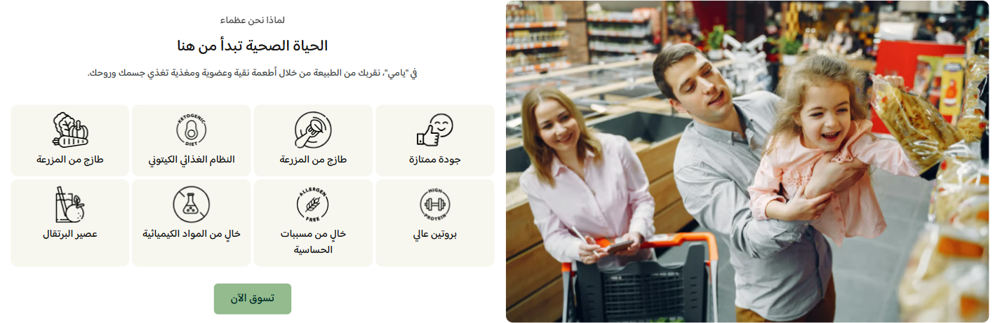

# لماذا نحن (Healthy living)

دليل العميل لسكشن **لماذا نحن**: مساحة تجمع نصًا تعريفيًا، صورة رئيسية، زرًا، وشبكة بطاقات لعرض أسباب الثقة أو مزايا المتجر.

| | |
|---|---|
| **الاسم في المحرر** | لماذا نحن |
| **الاسم بالإنجليزية** | Why We're Great |
| **الملفات** | `sections/healthy-living.jinja` · `sections/healthy-living.schema.json` |
| **الاستخدام** | شرح قيمة المتجر وإبراز الجودة، المنتجات الطازجة، الأنظمة الغذائية، أو معايير التصنيع |

---

## شكل السكشن على المتجر

<!-- live-preview-media -->

*لماذا نحن (Healthy living) - healthy-living-media-start*

---

## 1) كيفية الإضافة

1. افتح **محرر الثيم** واختر الصفحة المطلوبة.
2. اضغط **إضافة قسم** → **لماذا نحن**.
3. أدخل العنوان والوصف، وأضف عنوانًا فرعيًا عند الحاجة.
4. ارفع الصورة الرئيسية وحدد مكانها قبل المحتوى أو بعده.
5. أضف بطاقات الميزات واختر أيقونة لكل بطاقة.
6. فعّل الزر إذا كان المطلوب توجيه الزائر إلى صفحة أخرى.

> يدعم السكشن حتى 12 بطاقة ميزة. استخدم عناوين قصيرة حتى تبقى الشبكة متوازنة.

---

## 2) ترتيب الإعدادات في المحرر

### أ) المحتوى

| الإعداد | الشرح |
|---|---|
| إظهار العنوان الفرعي | يتحكم في ظهور النص الصغير أعلى العنوان |
| العنوان الفرعي | يظهر فقط عند تفعيل الخيار السابق |
| العنوان | الرسالة الرئيسية للسكشن |
| محاذاة النصوص | بداية، وسط، أو نهاية |
| الوصف | فقرة تعريفية أسفل العنوان |

لا تُحجز مساحة لأي نص فارغ؛ يعرض القالب الأجزاء التي تحتوي على محتوى فقط.

### ب) الصورة

- **الصورة الرئيسية:** الوسيط البصري بجوار المحتوى.
- **ملاءمة الصورة:** اختر **Cover** لملء الإطار أو **Contain** لإظهار الصورة كاملة.
- **رابط الصورة:** يجعل الصورة قابلة للنقر عند إدخال وجهة.

### ج) الزر

فعّل **إظهار الزر** ثم أدخل نص الزر ورابطه. لن يظهر الزر إلا عند اكتمال الشروط الثلاثة: التفعيل، النص، والرابط.

### د) التخطيط

| الإعداد | ماذا يفعل؟ |
|---|---|
| اتجاه القسم | تلقائي حسب لغة المتجر، RTL، أو LTR |
| موضع الصورة | قبل المحتوى أو بعده |
| مسافة الأعمدة | الفراغ بين الصورة والمحتوى على الويب |
| مسافة الصفوف | الفراغ عند تكديسهما على الموبايل |
| استدارة الصورة | تدوير زوايا إطار الصورة |
| نسبة عرض الصورة | تحدد عرض الإطار بالنسبة إلى ارتفاعه؛ `1.5` تعني صورة أعرض من ارتفاعها |
| المسافات الخارجية | علوية وسفلية مستقلة للويب والموبايل |
| عرض الشاشة بالكامل | يزيل قيد الحاوية المعتاد |

### هـ) شبكة الميزات

- أعمدة مستقلة للجوال الصغير، الجوال الكبير، التابلت، اللابتوب، والديسكتوب.
- مسافة البطاقات منفصلة للويب والموبايل.
- مسافة فوق الشبكة تفصلها عن النص.
- استدارة موحدة لجميع بطاقات الميزات.

### و) بطاقات الميزات

لكل بطاقة:

| الإعداد | الشرح |
|---|---|
| أيقونة جاهزة | جودة ممتازة، مزرعة طازجة، كيتو، بروتين، خالٍ من مسببات الحساسية، بلا مواد كيميائية، أو عصير |
| مخصص | عند اختياره يظهر حقل رفع أيقونة خاصة |
| العنوان | النص الظاهر داخل البطاقة |
| رابط البطاقة | اختياري؛ عند إدخاله تصبح البطاقة كاملة قابلة للنقر |

إذا لم يوجد عنوان ولا أيقونة صالحة، لا تُعرض البطاقة.

### ز) الألوان

يمكن تخصيص ألوان العنوان الفرعي، العنوان، الوصف، خلفية بطاقة الميزة، عنوان الميزة، خلفية الزر، ونص الزر. تظهر إعدادات ألوان الزر عند تفعيله.

### ح) الحركة

يمكن تفعيل أو تعطيل حركة الأيقونات، ثم اختيار:

- طفو خفيف.
- نبض.
- ارتداد.
- اهتزاز خفيف.
- تكبير عند المرور.
- رفع عند المرور.

تُطبّق الحركة بتأخير متدرج على البطاقات لإظهارها بإيقاع متتابع.

---

## 3) سيناريوهات جاهزة

### A — تعريف بجودة المتجر

- عنوان رئيسي مع وصف مختصر.
- صورة للمنتجات أو فريق العمل.
- 4 بطاقات: جودة، طازج، بلا مواد كيميائية، وشحن موثوق.
- 4 أعمدة على الديسكتوب وعمودان على الجوال.

### B — حملة لنمط غذائي

- استخدم أيقونات كيتو، بروتين، وخالٍ من مسببات الحساسية.
- اربط كل بطاقة بصفحة المجموعة المناسبة.
- اختر حركة **رفع عند المرور** أو **تكبير عند المرور**.

### C — قصة العلامة التجارية

- اجعل الصورة بعد المحتوى.
- استخدم عنوانًا فرعيًا قصيرًا، عنوانًا قويًا، ووصفًا من سطرين.
- فعّل الزر واربطه بصفحة «من نحن».

---

## ملاحظات مهمة

- السكشن لا يظهر إذا كانت الصورة وجميع عناصر المحتوى فارغة.
- الصورة وحدها تكفي لعرض السكشن، وكذلك المحتوى وحده.
- رابط الصورة مستقل عن رابط الزر وروابط بطاقات الميزات.
- عند اختيار الاتجاه التلقائي، يعتمد السكشن على لغة المتجر.
- الأيقونة المخصصة لا تظهر إلا عند اختيار **مخصص (رفع صورة)**.
- راجع عدد الأعمدة على الشاشات الصغيرة إذا كانت عناوين البطاقات طويلة.
