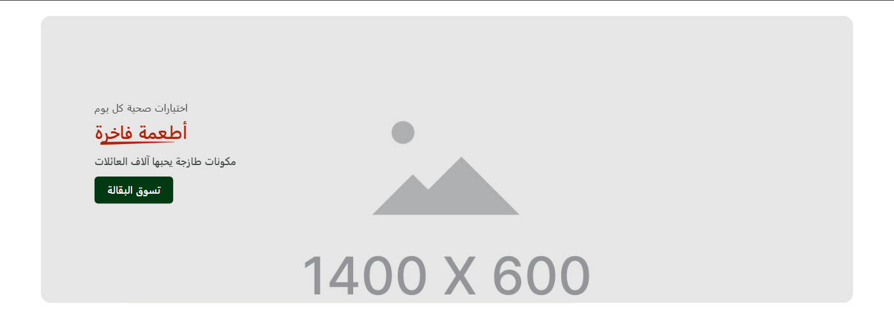
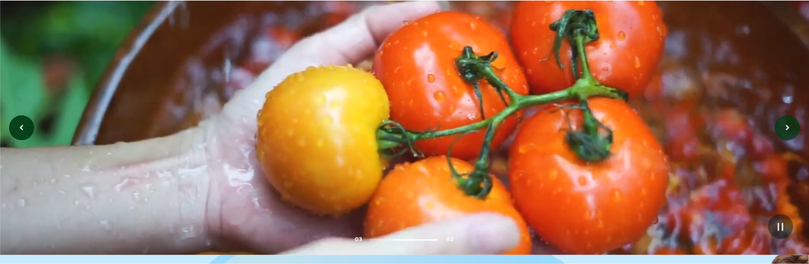

# سلايدر الهيرو (Hero slideshow)

> جزء من [الصفحة الواحدة لدليل الأقسام](../index.html#main-slider)

دليل العميل لسكشن **سلايدر الهيرو** في الثيم.

| | |
|---|---|
| **الاسم في المحرر** | سلايدر الهيرو |
| **الاسم بالإنجليزية** | Hero slideshow |
| **الملفات** | `sections/main-slider.jinja` · `sections/main-slider.schema.json` |
| **الاستخدام** | بانر رئيسي أعلى الصفحة بشرائح صورة أو فيديو + نص وزر |

---

## شكل السكشن على المتجر

من [المتجر الحي](https://rc9x9o.zid.store/ar-eg/):

---

## 1) كيفية الإضافة

1. افتح **محرر الثيم** في زد.
2. اختر الصفحة (غالبًا **الرئيسية**).
3. اضغط **إضافة قسم** → **سلايدر الهيرو**.
4. أضف الشرائح أولًا، ثم اضبط إعدادات السلايدر والارتفاع.

> نصيحة: ضع السكشن في أعلى الصفحة ليكون أول ما يراه الزائر.

---

## 2) ترتيب الإعدادات في المحرر

### أ) الشرائح (حتى 8)

لكل شريحة:

| الإعداد | الشرط | الشرح |
|---------|--------|--------|
| نوع الوسائط | — | صورة أو فيديو |
| موضع النص | — | يسار/بداية · منتصف · يمين/نهاية |
| النص العلوي | — | جملة صغيرة فوق العنوان |
| العنوان | — | العنوان الرئيسي للشريحة |
| تأكيد العنوان بخط سفلي | — | خط زخرفي تحت العنوان |
| الوصف | — | جملة داعمة تحت العنوان |
| من يرى الشريحة؟ | — | الجميع / زوار / مسجّلون |
| تقييد حسب الدولة | مفعّل | يظهر لدول محددة فقط |
| نوع رابط الشريحة / الزر | — | رابط / بحث / منتج |
| الرابط / كلمة البحث / المنتج | حسب النوع | وجهة الزر أو الشريحة |
| صورة سطح المكتب / الجوال | نوع = صورة | يفضّل صورة جوال منفصلة للشاشات الصغيرة |
| مصدر الفيديو + الملف/الرابط | نوع = فيديو | رفع أو رابط + بوستر |
| تشغيل تلقائي / تكرار / كتم / زر تشغيل | نوع = فيديو | سلوك الفيديو |
| لون خلفية الشريحة | — | يظهر خلف/حول الصورة |
| شفافية التعتيم | — | طبقة فوق الصورة لوضوح النص |
| ألوان النصوص | — | العلوي / العنوان / الوصف |
| إظهار الزر + نصه وألوانه | الزر مفعّل | CTA داخل الشريحة |

### ب) السلايدر

| الإعداد | الشرح |
|---------|--------|
| تشغيل تلقائي | تبديل الشرائح تلقائيًا |
| مدة العرض (ms) | يظهر مع التشغيل التلقائي |
| أنيميشن الانتقال | Fade / Slide / Cube / Coverflow / Flip وخيارات Creative |
| سرعة الأنيميشن (ms) | سرعة حركة الانتقال |
| تكرار لا نهائي | Loop |
| إظهار الأسهم | أزرار السابق/التالي |
| إخفاء شريط الترقيم | يخفي النقاط |
| إظهار مؤشر التقدم | حلقة تقدم مع التشغيل التلقائي |

### ج) التخطيط

| الإعداد | الشرح |
|---------|--------|
| ارتفاع سطح المكتب / الجوال | ارتفاع البانر بالبكسل |
| انحناء الزوايا | Border radius للإطار |
| المسافات (Padding) | أعلى/أسفل للجوال والويب |
| عرض الصورة/الفيديو كامل عرض الشاشة | Full-bleed لكل الشرائح |

### د) الألوان الافتراضية

خلفية القسم + خلفية الشريحة الافتراضية (تُستخدم إن لم تُحدد لكل شريحة).

---

## 3) سيناريوهات جاهزة

### سيناريو A — هيرو كلاسيكي مثل Yummy

1. شريحة أو أكثر بنوع **صورة**  
2. موضع النص: **بداية**  
3. فعّل الزر + عنوان بخط سفلي  
4. تشغيل تلقائي + أسهم + ترقيم  

### سيناريو B — شريحة فيديو صامتة

1. نوع الوسائط: **فيديو**  
2. ارفع فيديو أو ضع رابطًا + بوستر  
3. تشغيل تلقائي + كتم + تكرار  
4. أضف زر CTA فوق الفيديو  

### سيناريو C — عروض لجمهور محدد

1. عيّن «من يرى الشريحة؟» أو فلتر الدولة  
2. اربط الشريحة بمنتج أو بحث  

---

## 4) ملاحظات مهمة

1. **صورة الجوال** مهمة جدًا — صورة سطح المكتب العريضة غالبًا لا تناسب الشاشات الضيقة.  
2. **التعتيم** يساعد عندما يكون النص فوق صورة فاتحة/مزدحمة.  
3. أول شريحة تستخدم `<h1>` لتحسين SEO؛ الباقي عناوين فرعية.  
4. حجم مقترح تقريبي للصورة: حوالي **1400×600** (أو نسبة مشابهة لارتفاعك المختار).

---

## 5) روابط

- [الصفحة الواحدة](../index.html#main-slider)
- [`sections/main-slider.jinja`](../../sections/main-slider.jinja)
- [`sections/main-slider.schema.json`](../../sections/main-slider.schema.json)
