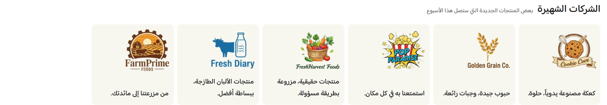

# شركات شائعة (Popular companies)

> جزء من [الصفحة الواحدة لدليل الأقسام](../index.html#popular-companies)

دليل العميل لسكشن **شركات شائعة**: بطاقات للشركات أو العلامات التجارية يمكن عرضها كشبكة أو سلايدر، مع تحكم في الشعار والوصف والرابط والجمهور والدولة.

| | |
|---|---|
| **الاسم في المحرر** | شركات شائعة |
| **الاسم بالإنجليزية** | Popular companies |
| **الملفات** | `sections/popular-companies.jinja` · `sections/popular-companies.schema.json` |
| **الاستخدام** | إبراز العلامات المتوفرة، شركاء المتجر، أو مجموعات موجهة لجمهور محدد |

---

## شكل السكشن على المتجر

يتكون من عنوان وعنوان فرعي اختياريين، ثم بطاقات شعارات. يمكن أن تكون البطاقة كاملة — شعار ووصف وزر — أو صورة فقط مع رابط. يدعم السكشن الشبكة والسلايدر والحركات البصرية الخفيفة.

<!-- live-preview-media -->

*شركات شائعة (Popular companies) - popular-companies-slider*

---

## 1) كيفية الإضافة

1. افتح **محرر الثيم** واختر الصفحة.
2. اضغط **إضافة قسم** → **شركات شائعة**.
3. اختر **شبكة** أو **سلايدر**.
4. أضف العنوان والعنوان الفرعي واضبط المحاذاة.
5. أضف الشركات، ثم اختر نوع كل بطاقة وارفع شعارها.
6. أضف الرابط ونص الزر عند استخدام البطاقة الكاملة.
7. راجع التخطيط والألوان والحركة، ثم اختبر الموبايل والديسكتوب.

> الحجم الموصى به للشعار هو 280×280 بكسل، ويفضل PNG شفاف أو WebP.

---

## 2) مجموعات الإعدادات

### أ) طريقة العرض والمحتوى

- **طريقة العرض:** شبكة أو سلايدر.
- **إظهار العنوان / العنوان الفرعي:** يجب تفعيل كل عنصر وكتابة نصه ليظهر.
- **محاذاة النصوص:** بداية أو وسط أو نهاية.

### ب) التخطيط

| الإعداد | الشرح |
|---|---|
| اتجاه القسم | تلقائي حسب لغة المتجر، RTL، أو LTR |
| المسافة بين البطاقات | مستقلة للويب والموبايل |
| استدارة البطاقة | من 0 إلى 24 بكسل |
| عرض الشعار | نسبة مستقلة للويب والموبايل من 20% إلى 80% |
| المسافات الخارجية | علوية وسفلية مستقلة للويب والموبايل |
| عرض الشاشة بالكامل | يمد السكشن إلى العرض الكامل |

### ج) الشبكة

تظهر عند اختيار **شبكة**، وتحدد الأعمدة لكل مقاس:

- جوال صغير وجوال كبير: 1–3.
- تابلت: 2–4.
- لابتوب: 2–6.
- ديسكتوب: 2–8.

### د) السلايدر

- عدد البطاقات الظاهرة للجوال الصغير والكبير والتابلت واللابتوب والديسكتوب.
- أسهم مستقلة للديسكتوب والموبايل.
- أشكال الأسهم: مستديرة، بإطار، أو شفافة، مع لون للخلفية والأيقونة.
- نقاط تنقل اختيارية: نقاط، حبوب، شريط تقدم، أو كسور.
- حركة السلايدر: انزلاق، سلس، سريع، أو مرن.
- تكرار لا نهائي وتشغيل تلقائي من 2000 إلى 8000 مللي ثانية.

### هـ) الألوان والحركة

يمكن تخصيص ألوان العنوان والعنوان الفرعي وخلفية البطاقة والوصف والزر وحالة التحويم. كما يمكن تفعيل حركة للشعارات واختيار: طفو، نبض، تكبير عند التحويم، أو ارتفاع عند التحويم.

### و) بطاقات الشركات (حتى 12)

| الإعداد | الشرح |
|---|---|
| نوع البطاقة | كاملة، أو صورة فقط مع رابط |
| الشعار وملاءمته | Cover لملء المساحة أو Contain لإظهار الشعار كاملًا |
| الوصف | يظهر في البطاقة الكاملة فقط |
| تفعيل الرابط | يتحكم في رابط البطاقة الكاملة |
| رابط الصورة | يستخدم في وضع الصورة فقط |
| زر التسوق | يظهر في البطاقة الكاملة عند توفر النص والرابط |
| الجمهور | الجميع، الزوار فقط، أو العملاء المسجلون |
| الدولة | تقييد البطاقة بدولة أو عدة دول |

---

## 3) الشروط والسلوك الفعلي

- البطاقة الكاملة لا تصبح قابلة للنقر إلا عند تفعيل الرابط وإدخال URL.
- زر التسوق يحتاج إلى: بطاقة كاملة، وتفعيل الزر، وكتابة النص، ووجود رابط صالح.
- في وضع **صورة فقط** يصبح الشعار رابطًا باستخدام حقل «رابط الصورة»، ولا يظهر الوصف أو الزر.
- تُخفى البطاقة إذا لم تطابق حالة الزائر إعداد الجمهور.
- عند تفعيل تقييد الدولة، تُقارن الدول بدولة الجلسة أو وجهة الشحن.
- يقبل حقل الدول فاصلة عربية أو إنجليزية، ويقارن الأسماء العربية والإنجليزية ورمز الدولة.
- التكرار الفعلي للسلايدر لا يعمل إلا إذا كان عدد البطاقات أكبر من أكبر عدد معروض في الشاشة.
- لا يظهر محتوى البطاقات إذا لم توجد بطاقات مطابقة بعد تطبيق شروط الجمهور والدولة.

---

## 4) سيناريوهات جاهزة

### A — دليل علامات تجارية

- شبكة من 2 عمود على الجوال و6 على الديسكتوب.
- بطاقة صورة فقط، وملاءمة Contain.
- شعارات شفافة موحدة الحجم، بدون حركة مستمرة.

### B — شركات مختارة مع وصف

- استخدم البطاقة الكاملة.
- أضف وصفًا قصيرًا وزر «تسوّق الآن».
- فعّل الرابط لكل شركة، واختر حركة ارتفاع عند التحويم.

### C — عروض حسب الجمهور أو الدولة

- خصص بطاقات للزوار وأخرى للعملاء المسجلين.
- فعّل تقييد الدولة للعروض المحلية.
- اكتب الدول مثل: `السعودية, الإمارات` واختبر وجهة الشحن.

### D — عدد كبير من الشركات

- اختر السلايدر.
- اعرض 2 بطاقة على الجوال و6 على الديسكتوب.
- فعّل الأسهم، وأضف شريط تقدم عند الحاجة.

---

## ملاحظات مهمة

- **Cover** قد يقص أطراف الشعار؛ استخدم **Contain** للشعارات التي يجب أن تظهر كاملة.
- إعدادات الشبكة والسلايدر تظهر بالتبادل حسب طريقة العرض.
- الأسهم والنقاط قد تختفي تلقائيًا عندما لا يوجد محتوى كافٍ للتنقل.
- إذا اختفت شركة، راجع الجمهور والدولة ووجهة الشحن قبل مراجعة التصميم.
- الروابط لا تُنشأ تلقائيًا؛ يجب إدخالها لكل بطاقة.
