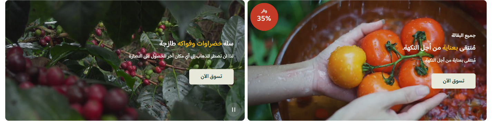

# شبكة الوسائط الترويجية (Promo media grid)

> جزء من [الصفحة الواحدة لدليل الأقسام](../index.html#promo-media-grid)

دليل العميل لسكشن **شبكة الوسائط الترويجية**: بطاقات كبيرة بخلفية صورة أو فيديو، وفوقها نصوص وزر وشارة خصم اختيارية.

| | |
|---|---|
| **الاسم في المحرر** | شبكة الوسائط الترويجية |
| **الاسم بالإنجليزية** | Promo media grid |
| **الملفات** | `sections/promo-media-grid.jinja` · `sections/promo-media-grid.schema.json` |
| **الاستخدام** | حملات مرئية، قصص منتجات، عروض فيديو، وبطاقات مخصصة للجمهور أو الدولة |

---

## شكل السكشن على المتجر

تظهر البطاقات في شبكة من عمود إلى 3 أعمدة على الديسكتوب، ومن عمود إلى عمودين على الموبايل. الوسائط تملأ البطاقة، وفوقها طبقة تعتيم ومحتوى قابل للمحاذاة والتموضع.

<!-- live-preview-media -->

*شبكة الوسائط الترويجية (Promo media grid) - promo-media-grid*

---

## 1) كيفية الإضافة

1. افتح **محرر الثيم** في زد.
2. اختر الصفحة ثم **إضافة قسم** → **شبكة الوسائط الترويجية**.
3. اضبط عدد الأعمدة وارتفاع البطاقة للويب والموبايل.
4. أضف حتى 6 بطاقات.
5. اختر صورة أو فيديو لكل بطاقة، ثم أضف المحتوى والزر والشارة.
6. راجع وضوح النص فوق الوسائط واختبر الفيديو على الجوال.

> للفيديو استخدم MP4 بحجم لا يتجاوز 10MB، وأضف غلافًا واضحًا ليظهر قبل تحميل الفيديو أو تشغيله.

---

## 2) ترتيب الإعدادات في المحرر

### أ) التخطيط

| الإعداد | النطاق |
|---|---|
| أعمدة الديسكتوب | 1 إلى 3 |
| أعمدة الموبايل | 1 أو 2 |
| المسافة بين البطاقات | 0–24px للويب و0–16px للموبايل |
| ارتفاع البطاقة | 200–600px للويب و160–400px للموبايل |
| استدارة البطاقة | 0–24px |
| المسافات الخارجية | قيم مستقلة أعلى وأسفل للويب والموبايل |
| عرض الشاشة بالكامل | يزيل حاوية العرض المقيدة ويمد الشبكة |

### ب) نوع الوسائط

عند اختيار **صورة** يظهر حقل الصورة فقط. وعند اختيار **فيديو** تظهر:

- ملف الفيديو MP4.
- غلاف الفيديو.
- تشغيل تلقائي صامت.
- زر تشغيل / إيقاف.

الفيديو يُعرض صامتًا ومتكررًا وداخل الصفحة. عند تعطيل التشغيل التلقائي، يستخدم الزائر زر التشغيل إن كان ظاهرًا. وإذا اختير فيديو بدون رفع ملف، يعرض القالب الصورة إن كانت محفوظة، وإلا تظهر مساحة بديلة.

### ج) المحتوى والتعتيم

| الإعداد | الشرح |
|---|---|
| شفافية التعتيم | من 0% إلى 60% لتحسين قراءة النص |
| محاذاة النص | بداية أو وسط أو نهاية |
| موضع المحتوى | أعلى أو وسط أو أسفل البطاقة |
| النص العلوي | عبارة قصيرة فوق العنوان |
| العنوان والوصف | الرسالة الأساسية والتفصيل |
| الكلمات المميزة | كلمات من العنوان يُطبق عليها لون مختلف |
| ألوان النص | ألوان مستقلة للنص العلوي والعنوان والتمييز والوصف |

اكتب الكلمات المميزة مفصولة بفاصلة، مثل: `طازج,اليوم`. يبحث السكشن عنها داخل العنوان ويطبق لون التمييز عليها.

### د) الزر والشارة

- عند تفعيل **إظهار الزر** تظهر حقول النص والرابط والخلفية ولون النص.
- الزر لا يظهر فعليًا إلا إذا وُجد **نص ورابط معًا**.
- عند تفعيل **إظهار شارة الخصم** تظهر تسمية الشارة وقيمتها وألوانها.
- الشارة لا تظهر إلا إذا كان حقل التسمية أو القيمة يحتوي نصًا؛ يمكن استخدام أحدهما أو كليهما.

### هـ) الجمهور والدولة

الاستهداف منفصل لكل بطاقة:

- **الجميع:** البطاقة متاحة لكل الزوار.
- **الزوار فقط:** تختفي عن العميل المسجل.
- **المسجلون فقط:** لا تظهر لغير المسجل.
- حقل الدول لا يظهر إلا بعد تفعيل **تقييد الظهور حسب الدولة**.
- يراجع القالب دولة الجلسة وكذلك وجهة الشحن المختارة.
- افصل الدول بفاصلة عربية أو إنجليزية، واكتب الاسم كما يظهر في المتجر؛ مثال: `مصر, السعودية`.
- تقبل المطابقة الاسم العربي أو الإنجليزي أو رمز الدولة، مع تسامح لبعض اختلافات الكتابة العربية.
- إذا فعّلت الفلتر وتركت الدول فارغة، لا يمنع القالب البطاقة؛ لذلك أضف القيم المقصودة.

### و) ملخص `visible_if`

| اختيارك | الإعدادات التي تظهر |
|---|---|
| نوع الوسائط = صورة | حقل الصورة |
| نوع الوسائط = فيديو | الفيديو، الغلاف، التشغيل التلقائي، وزر التحكم |
| إظهار الزر = مفعّل | نص الزر ورابطه وألوانه |
| إظهار الشارة = مفعّل | تسمية الشارة وقيمتها وألوانها |
| تقييد الدولة = مفعّل | أسماء الدول المسموحة |

هذه الشروط تنظّم المحرر، لكن القالب يضيف شروط اكتمال أيضًا؛ مثل ضرورة وجود نص ورابط لعرض الزر.

---

## 3) سيناريوهات جاهزة

### A — بطاقتا فيديو للحملات

- عمودان على الديسكتوب وعمود على الموبايل.
- فيديو MP4 قصير ومتكرر مع غلاف لكل بطاقة.
- تعتيم 25–35% ونص أبيض.
- زر واضح ينقل إلى صفحة الحملة.

### B — شبكة عروض مصورة

- 3 أعمدة على الديسكتوب وعمودان على الموبايل.
- ارتفاع متوسط موحد وصور متقاربة التكوين.
- شارة خصم على البطاقات التي تحمل عرضًا حقيقيًا فقط.

### C — محتوى محلي مخصص

- بطاقة لزوار مصر وأخرى للسعودية.
- فعّل فلتر الدولة واكتب الأسماء كما تظهر في نافذة الشحن.
- اجعل بطاقة للعملاء المسجلين تعرض مزايا الولاء أو عرض إعادة الطلب.

---

## ملاحظات مهمة

- إذا اختفت كل البطاقات بسبب الجمهور أو الدولة، لا يُطبع السكشن أصلًا.
- الفيديو لا يبدأ تحميله كاملًا مع الصفحة؛ وهذا يحسن الأداء، وقد يظهر الغلاف أولًا.
- زر تشغيل الفيديو منفصل عن زر الحملة؛ الأول يتحكم بالوسائط والثاني يفتح الرابط.
- ارتفاع البطاقة ثابت حسب المقاس، لذا اختبر قص الصورة أو الفيديو عند الأطراف.
- ارفع التعتيم عندما تكون الخلفية مزدحمة، وخفّضه عندما تكون الصورة داكنة أصلًا.
