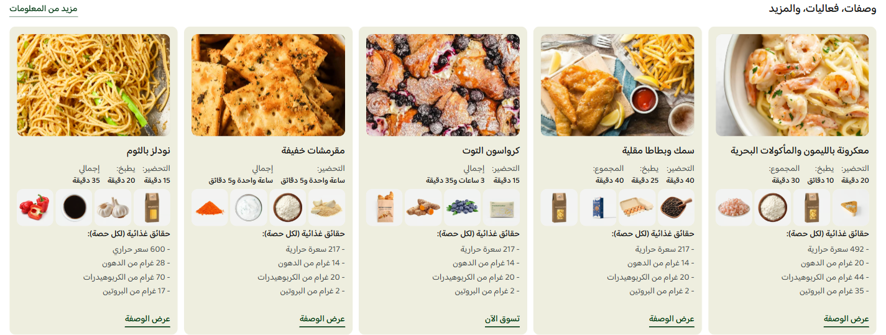

# وصفات وفعاليات (Recipes & Events)

> جزء من [الصفحة الواحدة لدليل الأقسام](../index.html#recipes-events)

دليل العميل لسكشن **وصفات وفعاليات**: بطاقات غنية لعرض الوصفات أو المناسبات، تشمل الصورة والأوقات والمكونات والقيم الغذائية وزرًا اختياريًا، ضمن سلايدر أو شبكة.

| | |
|---|---|
| **الاسم في المحرر** | وصفات وفعاليات |
| **الاسم بالإنجليزية** | Recipes & Events |
| **الملفات** | `sections/recipes-events.jinja` · `sections/recipes-events.schema.json` |
| **الاستخدام** | نشر وصفات مرتبطة بالمنتجات، فعاليات موسمية، أو محتوى تحريري قابل للنقر |

---

## شكل السكشن على المتجر

يعرض عنوانًا ورابط «المزيد» اختياريين، ثم بطاقات تحتوي على صورة وعنوان. يمكن إضافة أوقات التحضير والطهي والإجمالي، حتى 4 صور مكونات، حتى 4 قيم غذائية، وزر يفتح رابط البطاقة.

<!-- live-preview-media -->

*وصفات وفعاليات (Recipes & Events) - recipes-events-slider*

---

## 1) كيفية الإضافة

1. افتح **محرر الثيم** واختر الصفحة المطلوبة.
2. اضغط **إضافة قسم** → **وصفات وفعاليات**.
3. اختر السلايدر أو الشبكة.
4. أضف عنوان القسم ورابط المزيد عند الحاجة.
5. أضف البطاقات بالترتيب المطلوب.
6. لكل بطاقة ارفع الصورة، واكتب العنوان والرابط، ثم فعّل أقسام التفاصيل المطلوبة.
7. اضبط التخطيط والألوان والسلايدر أو الشبكة.

> الصورة الموصى بها 800×450 بكسل بنسبة 16:9 عند استخدام النسبة الافتراضية.

---

## 2) مجموعات الإعدادات

### أ) المحتوى

- إظهار عنوان القسم وكتابة نصه.
- محاذاة العنوان: بداية أو وسط أو نهاية.
- إظهار رابط المزيد، ثم كتابة النص والرابط.
- رابط المزيد لا يظهر فعليًا إلا عند توفر التفعيل والنص والوجهة معًا.

### ب) التخطيط

| الإعداد | الشرح |
|---|---|
| اتجاه القسم | تلقائي حسب اللغة، RTL، أو LTR |
| فجوات البطاقات | قيم مستقلة للويب والموبايل |
| استدارة الزوايا | للبطاقة والصورة |
| نسبة الصورة | 16:9، 4:3، 3:2، 1:1، 3:4، 2:3، أو 21:9 |
| خلفية البطاقة | لون موحد للبطاقات |
| المسافات | علوية وسفلية مستقلة للويب والموبايل |
| عرض كامل | يمد السكشن إلى عرض الشاشة |

### ج) الشبكة

تظهر عند اختيار **شبكة**:

- جوال صغير وكبير: 1–3 أعمدة.
- تابلت: 2–4 أعمدة.
- لابتوب: 2–5 أعمدة.
- ديسكتوب: 2–6 أعمدة.

### د) السلايدر

- عدد بطاقات مستقل لخمسة مقاسات؛ يقبل أنصاف البطاقات لإظهار جزء من البطاقة التالية.
- أسهم منفصلة للديسكتوب والموبايل.
- ثلاثة أشكال للأسهم مع ألوان مخصصة.
- نقاط اختيارية بأربعة أنماط: نقاط، حبوب، شريط تقدم، أو أرقام.
- حركة انزلاق عادية أو ناعمة أو سريعة أو مرنة.
- تكرار وتشغيل تلقائي بتأخير 2000–8000 مللي ثانية.

### هـ) الألوان

ألوان مستقلة لعنوان القسم، رابط المزيد والهوفر، عنوان البطاقة، تسميات الأوقات وقيمها، عنوان القيم الغذائية وعناصرها، وزر البطاقة والهوفر.

### و) البطاقات (حتى 12)

| المجموعة | الحقول |
|---|---|
| الأساسيات | الصورة، Cover/Contain، العنوان، الرابط |
| الأوقات | إظهار الأوقات، تسمية وقيمة التحضير والطهي والإجمالي |
| المكونات | إظهار المكونات، وحتى 4 صور |
| التغذية | إظهار القيم، عنوان، وحتى 4 عناصر نصية |
| الزر | إظهار الزر ونصه |
| الاستهداف | الجميع، الزوار، أو المسجلون؛ وتقييد اختياري حسب الدولة |

---

## 3) الشروط والسلوك الفعلي

- صورة البطاقة وعنوانها يصبحان رابطين عند إدخال رابط البطاقة.
- زر البطاقة يظهر عند تفعيله وكتابة نصه، لكنه يكون معطّلًا دلاليًا إذا لم يوجد رابط.
- قسم الأوقات لا يظهر إلا عند تفعيله ووجود قيمة واحدة على الأقل؛ التسمية وحدها لا تكفي.
- المكونات لا تظهر إلا عند التفعيل ورفع صورة واحدة على الأقل.
- القيم الغذائية تظهر عند التفعيل ووجود عنوان أو عنصر واحد على الأقل.
- تُخفى البطاقة إذا لم تطابق جمهور الزائر أو دولته.
- الدول تقبل فاصلة عربية أو إنجليزية، وتعتمد على دولة الجلسة أو وجهة الشحن.
- إذا لم تبق أي بطاقة بعد الفلاتر، تظهر رسالة تطلب إضافة وصفات أو فعاليات.
- الأسهم والنقاط لا تظهر إذا لم يكن عدد البطاقات كافيًا للتنقل.
- التكرار لا يعمل إلا عندما يتجاوز عدد البطاقات أكبر عدد ظاهر في أي مقاس.

---

## 4) سيناريوهات جاهزة

### A — وصفات سريعة

- سلايدر بنسبة 16:9.
- 1.5 بطاقة على الجوال و5 على الديسكتوب.
- أظهر التحضير والإجمالي فقط.
- أضف صور مكونات مختصرة وزر «عرض الوصفة».

### B — دليل وصفات تفصيلي

- شبكة بعمودين للجوال و4 للديسكتوب.
- أظهر جميع الأوقات والقيم الغذائية.
- استخدم صورًا موحدة وملاءمة Cover.
- أضف رابط المزيد إلى صفحة الوصفات.

### C — فعاليات ومناسبات

- أخفِ المكونات والقيم الغذائية.
- استخدم حقول الوقت لعرض البداية والمدة بتسميات مخصصة.
- اجعل الزر «تفاصيل الفعالية» أو «احجز الآن».

### D — محتوى محلي

- أنشئ بطاقات منفصلة لكل دولة.
- فعّل تقييد الدولة واكتب الأسماء مثل: `السعودية, البحرين`.
- اختبر العرض كزائر وكعميل مسجل إذا استخدمت شرط الجمهور أيضًا.

---

## ملاحظات مهمة

- حقول الوقت نصية؛ اكتب الوحدة بوضوح، مثل `20 دقيقة`.
- صور المكونات صور فقط ولا يوجد اسم نصي لكل مكوّن.
- **Contain** يعرض الصورة كاملة وقد يترك فراغًا، بينما **Cover** يملأ المساحة وقد يقص الأطراف.
- رابط المزيد وزر البطاقة يحتاجان وجهة URL صالحة ليعملا.
- إذا اختفت بطاقة، راجع الجمهور والدولة قبل إعدادات الصورة والتخطيط.
