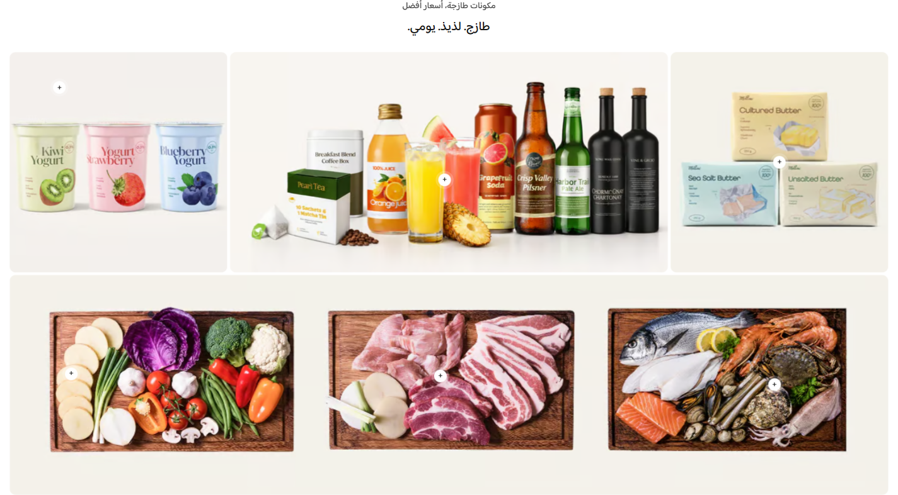

# تسوق المظهر (Shop the Look)

دليل العميل لسكشن **تسوق المظهر**: شبكة صور تفاعلية توضع فوقها نقاط تركيز مرتبطة بمنتجات، ليتمكن الزائر من استكشاف عناصر المشهد وبياناتها.

| | |
|---|---|
| **الاسم في المحرر** | تسوق المظهر (Hotspots) |
| **الاسم بالإنجليزية** | Shop the Look |
| **الملفات** | `sections/shop-look.jinja` · `sections/shop-look.schema.json` |
| **الاستخدام** | ربط المنتجات داخل صورة تنسيق، غرفة، وصفة، إطلالة، أو مجموعة متكاملة |

---

## شكل السكشن على المتجر

<!-- live-preview-media -->

*تسوق المظهر (Shop the Look) - shop-look-hotspots*

---

## 1) كيفية الإضافة

1. افتح **محرر الثيم** واختر الصفحة.
2. اضغط **إضافة قسم** → **تسوق المظهر (Hotspots)**.
3. أدخل العنوان والعنوان الفرعي.
4. أضف بطاقة وارفع صورة المشهد.
5. أضف نقاط التركيز داخل البطاقة؛ اختر منتجًا واضبط موضع كل نقطة.
6. راجع المواضع على الديسكتوب والموبايل كلٌ على حدة.
7. اختر إجراء النقر: صفحة المنتج، عرض سريع، أو دون إجراء.

> يمكن إضافة حتى 8 بطاقات، وداخل كل بطاقة حتى 8 نقاط تركيز.

---

## 2) ترتيب الإعدادات في المحرر

### أ) العنوان

- إظهار أو إخفاء العنوان الفرعي، مع لون مستقل.
- إظهار أو إخفاء العنوان الرئيسي، مع المحاذاة واللون.
- ترتيب النصين: **فرعي ثم عنوان** أو **عنوان ثم فرعي**.
- إذا كان النص مخفيًا أو فارغًا فلن تُحجز له مساحة.

### ب) التخطيط

| الإعداد | الشرح |
|---|---|
| اتجاه القسم | تلقائي حسب لغة المتجر، RTL، أو LTR |
| مسافة البطاقات | قيمة مستقلة للويب والموبايل |
| مسافة العنوان عن الشبكة | قيمة مستقلة للويب والموبايل |
| ارتفاع البطاقة | قيمة مستقلة للويب والموبايل |
| استدارة البطاقة | تدوير زوايا الصور |
| المسافات العلوية والسفلية | قيم مستقلة للويب والموبايل |
| عرض الشاشة بالكامل | يمد السكشن إلى العرض الكامل |

### ج) نقاط التركيز العامة

| الإعداد | ماذا يفعل؟ |
|---|---|
| لون النقطة الافتراضي | اللون المستخدم في جميع البطاقات ما لم تخصص بطاقة |
| حجم النقطة | حجم مستقل للويب والموبايل |
| تأثير النبض | يضيف حلقة متحركة حول النقطة |
| إجراء النقر | فتح المنتج، العرض السريع، أو إظهار التلميح دون انتقال |

النقرة الأولى تفتح تلميح المنتج. الإجراء المختار يطبق من التلميح أو بنقرة متابعة بحسب الجهاز.

### د) البطاقات

لكل بطاقة:

- صورة المشهد.
- عرض العمود على الديسكتوب: ربع، نصف، ثلاثة أرباع، أو عرض كامل من شبكة من 4 أعمدة.
- لون وحجم نقاط خاصان بالبطاقة عند تفعيل التخصيص.
- جمهور البطاقة: الجميع، الزوار، أو العملاء المسجلون.
- تقييد اختياري حسب الدولة.
- قائمة نقاط التركيز.

### هـ) إعداد كل نقطة

| الإعداد | الشرح |
|---|---|
| المنتج | منتج واحد تُجلب صورته واسمه وعلامته وسعره |
| Left وTop للديسكتوب | موضع أفقي ورأسي كنسبة من أبعاد الصورة |
| Left وTop للموبايل | موضع مستقل للشاشات الصغيرة |
| لون عنوان التلميح | لون اسم المنتج |
| لون السعر | لون سعر المنتج |
| خلفية التلميح | خلفية بطاقة المعلومات |

القيمة `0%` تعني بداية الحافة، و`100%` نهايتها، و`50%` المنتصف. راقب اتجاه السكشن والصورة بصريًا بدل الاعتماد على الاسم الإنجليزي للحقل فقط.

---

## 3) الاستهداف

يمكن التحكم في ظهور كل بطاقة:

- **الجميع:** تظهر دون شرط تسجيل الدخول.
- **الزوار فقط:** تختفي عن العملاء المسجلين.
- **المسجلون فقط:** تختفي عن الزوار.
- **حسب الدولة:** تقارن أسماء الدول بالدولة المختارة في نافذة الشحن.

لأكثر من دولة، افصل بفاصلة: `مصر, السعودية`. يقبل القالب الأسماء العربية والإنجليزية ورمز الدولة عندما يكون متاحًا في الجلسة.

---

## 4) سيناريوهات جاهزة

### A — إطلالة كاملة

- بطاقة بصورة كاملة العرض.
- 3 إلى 5 نقاط للملابس والإكسسوارات.
- اختر **عرض سريع** لتقليل مغادرة الصفحة.

### B — شبكة غرف أو وصفات

- استخدم 4 بطاقات بعرض ربع الشبكة أو بطاقتين بنصف العرض.
- اجعل الارتفاع متساويًا.
- ضع نقاطًا قليلة وواضحة حتى لا تتداخل التلميحات.

### C — تشكيلة حسب الدولة

- أنشئ بطاقة لكل سوق.
- فعّل تقييد الدولة على كل بطاقة.
- اربط النقاط بمنتجات متاحة في السوق المستهدف.

---

## ملاحظات مهمة

- اضبط موضع الموبايل فعليًا؛ نسخ موضع الديسكتوب قد يضع النقطة فوق عنصر مختلف بسبب قص الصورة.
- النقطة التي لا تحتوي على منتج تعرض طلب اختيار منتج، ولا تستطيع فتح صفحة أو عرض سريع.
- العرض السريع يحتاج منتجًا صالحًا؛ وإلا يقتصر السلوك على فتح التلميح.
- إعدادات لون وحجم البطاقة تتجاوز الإعدادات العامة فقط عند تفعيل **تخصيص لون/حجم النقطة**.
- إذا اختفت بطاقة، راجع الجمهور والدولة قبل مراجعة الصورة.
- تجنب وضع النقاط قرب الحواف حتى تبقى نافذة التلميح مقروءة على الشاشات الصغيرة.
