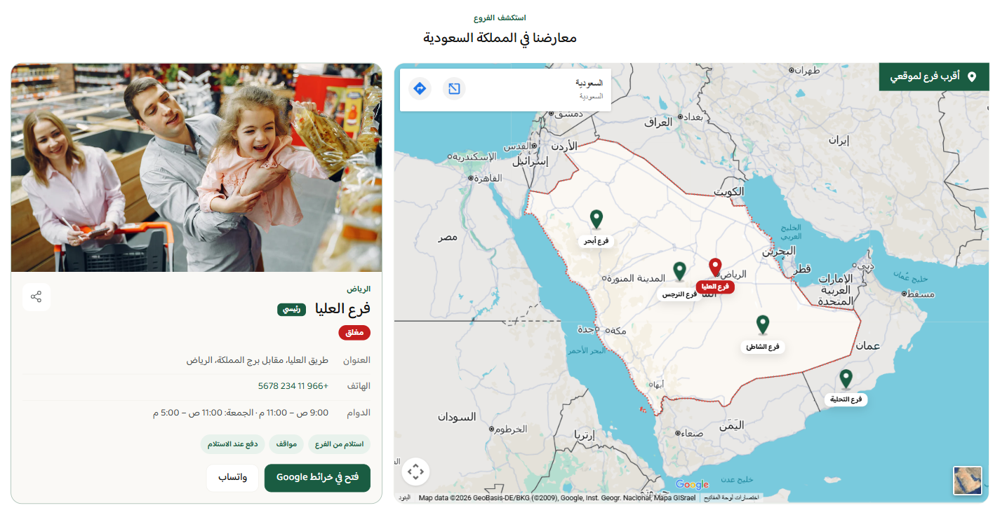

# فروع المتجر — خريطة وتفاصيل (Store branches)

دليل العميل لسكشن **فروع المتجر**: خريطة تفاعلية مع دبابيس ولوحة تفاصيل لكل فرع، وأزرار للاتجاهات وواتساب والمشاركة والعثور على أقرب فرع.

| | |
|---|---|
| **الاسم في المحرر** | فروع المتجر (خريطة + تفاصيل) |
| **الاسم بالإنجليزية** | Store branches (map + details) |
| **الملفات** | `sections/store-branches.jinja` · `sections/store-branches.schema.json` |
| **الاستخدام** | عرض مواقع الفروع وبيانات الاتصال والدوام والخدمات في مكان واحد |

---

## شكل السكشن على المتجر

يظهر رأس اختياري، ثم خريطة ولوحة تفاصيل. الضغط على دبوس يبدّل الفرع النشط وتفاصيله، وقد يغيّر الخريطة إلى Embed خاص بذلك الفرع. يمكن إظهار حالة الدوام وأقرب فرع وأزرار المشاركة والخرائط وواتساب.

<!-- live-preview-media -->

*فروع المتجر — خريطة وتفاصيل (Store branches) - store-branches-map*

---

## 1) كيفية الإضافة

1. افتح **محرر الثيم** واختر الصفحة.
2. اضغط **إضافة قسم** → **فروع المتجر (خريطة + تفاصيل)**.
3. أضف عنوان السكشن ووصفه.
4. اختر نوع الخريطة وأدخل رابط Embed أو كود iframe، أو استخدم الدبابيس فقط.
5. أضف فرعًا واحدًا على الأقل واملأ بياناته.
6. أضف رابط الاتجاهات وإحداثيات خط العرض والطول لكل فرع.
7. اضبط موضع الدبوس يدويًا فوق الخريطة.
8. راجع الأزرار والميزات والتخطيط والألوان.

> السكشن لا يظهر إطلاقًا إذا لم توجد بطاقة فرع تحتوي على أي بيانات.

---

## 2) مجموعات الإعدادات

### أ) المحتوى

- نص علوي صغير Kicker.
- عنوان القسم.
- وصف اختياري؛ يجب تفعيل إظهاره وكتابة النص.

### ب) الخريطة

| النوع | المطلوب |
|---|---|
| رابط Embed | رابط مثل `https://www.google.com/maps/embed?pb=...` |
| كود iframe | لصق كود iframe كامل؛ يستخرج السكشن قيمة `src` |
| خلفية + دبابيس | لا يحتاج Embed، ويعرض خلفية تصميمية مع الدبابيس |

كما يمكن إظهار دبابيس الفروع فوق الخريطة وإبقاء اسم كل فرع ظاهرًا دائمًا.

### ج) الميزات الإضافية

- حالة الفتح أو الإغلاق اعتمادًا على حقول الدوام.
- زر «أقرب فرع لموقعي»؛ يحتاج إحداثيات لكل فرع وإذن الموقع من الزائر.
- نص مخصص لزر أقرب فرع.
- زر مشاركة الفرع.
- رسالة مخصصة بعد نسخ الرابط.

### د) الفروع (حتى 24)

| المجموعة | الحقول |
|---|---|
| التعريف | صورة، مدينة، اسم الفرع، عنوان |
| التواصل | هاتف، رقم واتساب |
| الدوام | دوام أيام الأسبوع، دوام الجمعة |
| الخدمات | نص مفصول بفواصل يتحول إلى وسوم |
| الخرائط | رابط اتجاهات، وخريطة خاصة اختيارية للفرع |
| الدبوس | موقع أفقي وعمودي من 5% إلى 95% |
| الموقع الجغرافي | Latitude وLongitude لميزة أقرب فرع |
| الأولوية | تعيين الفرع كفرع رئيسي |

خريطة الفرع يمكن أن ترث خريطة السكشن أو تستخدم رابط Embed أو iframe خاصًا بها.

### هـ) الأزرار

- نص زر الخرائط.
- نص زر واتساب.
- إظهار أو إخفاء واتساب.
- فتح الخرائط في تبويب جديد.

### و) التخطيط

- موضع لوحة التفاصيل: بداية القراءة أو نهايتها؛ يتغير الجانب الفعلي مع RTL/LTR.
- اتجاه القسم: تلقائي، RTL، أو LTR.
- عرض كامل.
- ارتفاع الخريطة مستقل للديسكتوب والموبايل.
- عرض لوحة التفاصيل من 28% إلى 48%.
- استدارة الزوايا.
- مسافات علوية وسفلية مستقلة للديسكتوب والموبايل.

### ز) الألوان

تشمل خلفية القسم واللوحة، العنوان والنص وKicker، لون التمييز والأزرار، خلفية وسوم الخدمات، لون الدبوس والعنصر النشط، ولون الحدود.

---

## 3) الشروط والسلوك الفعلي

- يجب وجود فرع واحد على الأقل يحتوي على اسم أو مدينة أو عنوان أو وسيلة اتصال أو دوام أو خدمة أو خريطة أو صورة.
- يبدأ السكشن بالفرع الأول، إلا إذا وُجد فرع معلّم كـ «رئيسي» فيصبح هو النشط.
- إذا عُلّم أكثر من فرع كرئيسي، يصبح آخر فرع رئيسي في القائمة هو النشط.
- زر أقرب فرع يظهر فقط عند وجود أكثر من فرع وتفعيل الميزة.
- العثور على الأقرب يحتاج Latitude وLongitude صالحين وإذن الموقع من المتصفح.
- حالة الدوام لا تظهر إلا عند تفعيلها ووجود دوام أيام الأسبوع أو الجمعة.
- زر الخرائط لا يظهر دون رابط اتجاهات للفرع.
- زر واتساب يحتاج تفعيل الخيار ورقمًا؛ تُزال المسافات وعلامة `+` والشرطات قبل إنشاء رابط `wa.me`.
- رقم الهاتف يتحول إلى رابط اتصال بعد إزالة المسافات والشرطات والأقواس من وجهة الرابط.
- الخدمات تقبل الفاصلة العربية أو الإنجليزية والأسطر الجديدة، وتتحول إلى وسوم منفصلة.
- رابط `maps.app.goo.gl` أو `goo.gl/maps` لا يُقبل كخريطة iframe؛ استخدمه في «رابط الاتجاهات».
- إذا لم يوجد Embed صالح، تظهر خلفية خريطة تصميمية ويمكن إبقاء الدبابيس فوقها.
- عند اختيار فرع له Embed خاص، تتغير الخريطة إليه؛ وإلا يرث خريطة السكشن.
- مواقع الدبابيس نسب بصرية فوق مساحة الخريطة وليست مشتقة من Latitude وLongitude.

---

## 4) سيناريوهات جاهزة

### A — فرع واحد

- أضف Embed للخريطة ورابط اتجاهات.
- أخفِ زر أقرب فرع لأنه لا يضيف فائدة.
- أضف الهاتف والواتساب والدوام والخدمات الأساسية.

### B — سلسلة فروع

- أضف خريطة عامة للسكشن.
- أضف إحداثيات كل فرع وفعّل «أقرب فرع».
- اضبط مواضع الدبابيس بصريًا، وعيّن الفرع الرئيسي.
- استخدم رابط اتجاهات مستقل لكل فرع.

### C — خريطة مستقلة لكل فرع

- اجعل خريطة السكشن افتراضية.
- في كل فرع اختر رابط Embed أو iframe خاصًا.
- اختبر تبديل الدبابيس وتأكد أن كل خريطة تعرض الموقع الصحيح.

### D — دليل فروع بلا خريطة مضمنة

- اختر «خلفية + دبابيس تفاعلية فقط».
- اضبط موضع كل دبوس يدويًا.
- اعتمد على رابط الاتجاهات لفتح Google Maps الفعلي.

---

## 5) إعداد روابط Google Maps بشكل صحيح

- **للعرض داخل السكشن:** استخدم رابط Embed من Google Maps عبر «مشاركة» → «تضمين خريطة»، أو الصق كود iframe كاملًا.
- **لزر الاتجاهات:** يمكن استخدام رابط المشاركة العادي أو الرابط المختصر `maps.app.goo.gl`.
- لا تضع رابط المشاركة المختصر في حقل Embed لأنه لن يعمل داخل iframe.
- عند استخدام خريطة خاصة بالفرع، اختر نوع المصدر الموافق للحقل الذي ستملؤه.

---

## ملاحظات مهمة

- حقول الدوام نصية، لذلك اكتبها بصيغة واضحة ومتسقة حتى تعمل حالة الفتح/الإغلاق بصورة صحيحة.
- أدخل رقم واتساب بصيغة دولية، مثل `+966501234567`.
- الإحداثيات تستخدم لحساب المسافة فقط، بينما `pin_x` و`pin_y` يحددان مكان الدبوس بصريًا.
- مشاركة الفرع تستخدم واجهة المشاركة في الجهاز عند توفرها، وإلا تنسخ الرابط وتعرض رسالة النسخ.
- اختبر إذن الموقع، روابط الاتصال، واتساب، والخرائط على جهاز فعلي قبل النشر.
